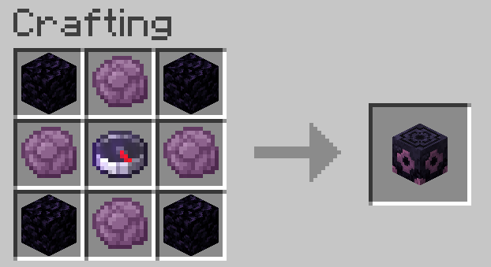
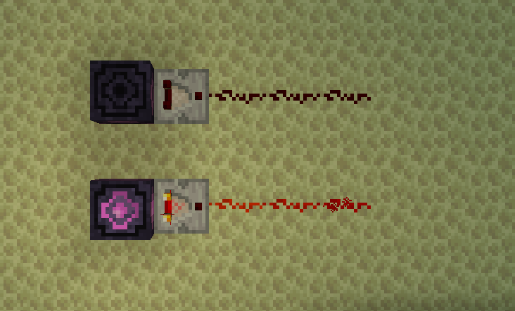
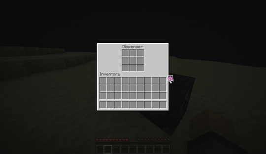

# Sit's End Anchor

This mod adds a new block: the End Anchor, which allows you to teleport in the End dimension in a vanilla-like style.

## Crafting

Four obsidian on the corners, four popped chorus fruit on the sides, and a lodestone compass pointing to a lodestone in the End.

> Unfortunately, it's currently impossible to modify the crafting recipe using data packs.

## Using the block

<video height="256" autoplay controls src="screenshots/using.mp4"></video>

Before you teleport, charging the anchor is required. Right-click with an end crystal to do that.

When charged, the block lights up, indicating that it's ready to be used. Right-click again to teleport.

You will be teleported on top of the lodestone the compass was pointing to.
If the lodestone is broken or obstructed, teleportation will fail.

## Breaking the block

If broken without Silk Touch, only the lodestone compass is dropped.
If the tool has Silk Touch, the whole block can be picked up.

Ender dragons cannot break the End Anchor.

## Redstone mechanics

When charged with an end crystal, the block outputs 15 redstone power through a comparator.

You can also point a dispenser with end crystals at the anchor and charge it using redstone!

## Explosions

If you try to use the End anchor in another dimension (in the overworld or the nether), it will explode.
The explosion is two times bigger if the block had been charged before exploding.
